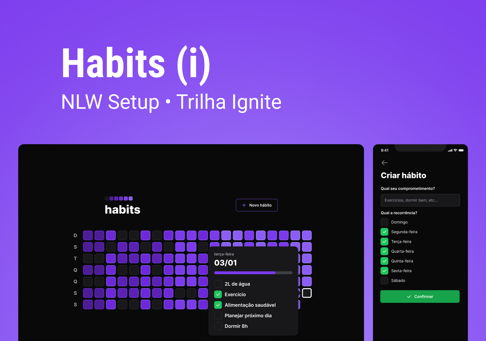

# Cadastro de Hábitos
### Aplicação de cadastro de hábitos

  <a href="#-tecnologias">Tecnologias</a>&nbsp;&nbsp;&nbsp;|&nbsp;&nbsp;&nbsp;
  <a href="#-projeto">Projeto</a>&nbsp;&nbsp;&nbsp;|&nbsp;&nbsp;&nbsp;
  <a href="#-layout">Layout</a>&nbsp;&nbsp;&nbsp;|&nbsp;&nbsp;&nbsp;

  

# 🚀  Techs

Tecnologias utilizadas neste projeto:

- Javascript
- ReactJS
- Vite
- NPM
- CSS & Flexbox
- Radix Library
- Figma

## 💻 Projeto

Gerencie os seus hábitos de forma organizada.

- [Visite o projeto online](https://alissonmoraesdev.github.io/habitsmobile)